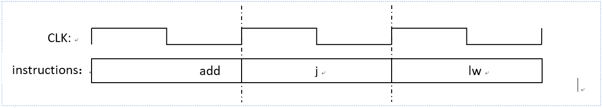
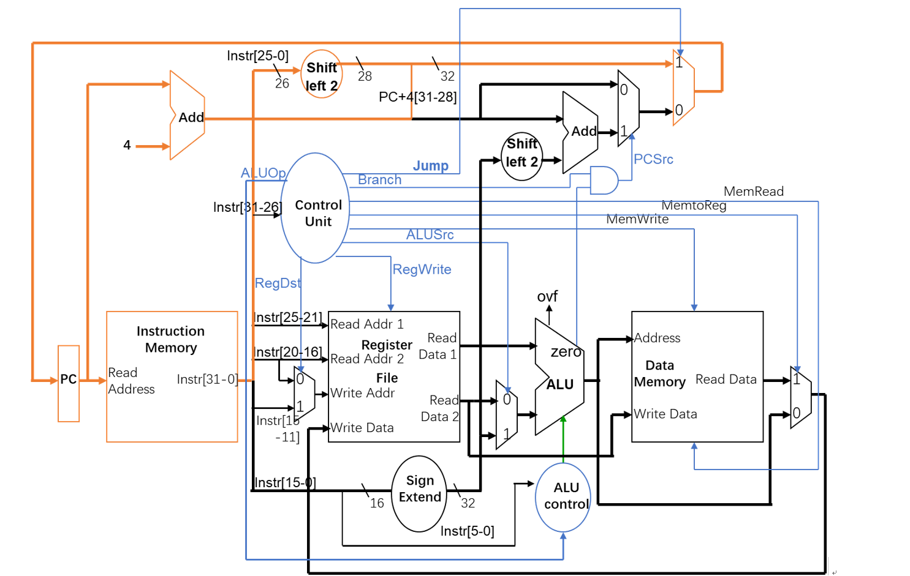

> Which boy doesn't want to build his own CPU?
> This blog is base on the REPORT of homework: **Single Cycle Central Processing Unit** in `DCS209 - Laboratory of Computer Organization`.

# Design Experiment of Single Cycle CPU

***Chen Yuhan, 19335025, chenyh369@mail2.sysu.edu.cn,*** *Teacher: Prof. Guo Xuemei, TAs: Wang Tingwei & Ding Wen, School of Data and Computer Science, Sun Yat-sen University, started on Nov.27th and completed on TODO:.*

## Purpose

1. Understand the instruction system commonly used in MIPS and master the working principle and logic function realization of the single cycle CPU.
2. By observing and analyzing the running condition of single cycle CPU, we can further understand it.

## Devices

1. A PC with Xilinx Vivado 2017.4 installed
2. Xilinx FPGA BASYS 3 platform

## Tasks

1. Based on Xilinx FPGA basys3 experimental platform, using HDL language (Verilog HDL language or VHDL language) to achieve the design of a single cycle CPU. The single cycle CPU can complete at least 16 MIPS instructions, including at least the following instructions:
   1. Support basic memory operations such as `lw`, `sw` instructions
   2. Support basic arithmetic logic operations such as `add`, `sub`, `and`, `ori`, `slt`, `addi` instructions
   3. Support basic program control such as `beq`, `j` instruction
2. Master the relevant functions of each instruction and output the simulation results for verification.
3. Finally, it is implemented on FGPA, and the ALU calculation results are displayed on the digital tube of the development board.

## Experimental Principle

### About Single Cycle CPU

#### Characteristic

The characteristic of single cycle CPU is that __each instruction only needs one clock cycle, and the next instruction is executed after one instruction is executed.__ In this cycle, address update, fetch, decode, execute, memory operation and register operation are completed. Since the address is updated at the `posedge` of each clock cycle, all operations must be completed before the `posedge` comes. Except for using a `negedge`, all the operations can only be solved by using combinatorial logic. This brings some difficulties to the manufacture of registers and RAM. And because the time length of each clock cycle must be uniform, __the time length of clock cycle should be determined according to the instruction time with the longest delay, which also limits its execution efficiency.__

The single cycle CPU updates the `PC` at the `posedge` of each CLK and reads new instructions. No matter how long the instruction is executed, it must be completed before the next `posedge` comes.

Figure 1: Timing diagram of single cycle CPU

#### Top-level Structure

The figure below shows the top-level implementation of a single cycle CPU. The main devices include `program counter PC`, `program memory`, `register file`, `ALU`, `data memory` and `control unit`.

Figure 2: Reference for detailed logic design diagram of single cycle CPU

Ctrl Unit:

- `JUMP`: choose the destination address to jump if it is `1` and otherwise choose the address that chosen by `Branch`.
- `Branch`:
- `MemtoReg`:
- `MenWrite`:
- `RegWrite`:
- `RegDst`:
- `ExtOp`:
- `ALUOP`:
- `ALUSrc`:

>TODO: To be done.
